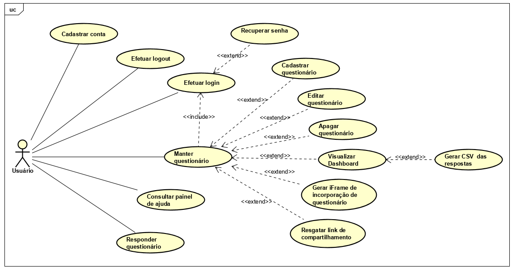

# Documento de Arquitetura de Software 
## 1. Introdução
### 1.1 Finalidade
Este documento tem como objetivo informar, de uma forma geral, a arquitetura do projeto Questmark. Tanto o comportamento do software, quanto as tecnologias utilizadas para o desenvolvimento do mesmo devem ser expostas de forma clara, explicativa e objetiva para o leitor. 

### 1.2 Escopo
Questmark é uma plataforma que irá possibilitar a criação de formulários em Markdown, de uma forma descomplicada, para qualquer usuário que fizer cadastro no mesmo. O projeto também dá ao cliente a comodidade de visualizar um dashboard, de simples entendimento, com as respostas dadas em seu formulário por um terceiro usuário. Se caso o usúario preferir, poderá baixar as respostas em um arquivo CSV. O documento apresentará toda a parte arquitetural para a confecção do Questmark, a fim de tornar claras as características arquiteturais do projeto.

### 1.3 Definições, Acrônimos e Abreviações
* **FGA:** Faculdade do Gama - Campus da Universidade de Brasília localizado no Gama.
* **MDS:** Métodos de Desenvolvimento de Software.
* **UnB:** Universidade de Brasília.
* **Markdown:** Linguagem de marcação.
* **MVC:** Model View Controller.
* **HTTP:** Protocolo de comunicação utilizado para sistemas de informação de hipermídia.
* **CRUD:** Create Read Update Delete.
* **JSON:** JavaScript Object Notation.
* **VM:** Virtual Machine.
* **CSV:** Comma Separated Values.
* **API:** Application Programming Interface.

### 1.4 Referências
>André; Gabriel; Guilherme; ALMEIDA; Weyler. Cidade Democrática: Documento de Arquitetura. Disponível em: <https://github.com/fga-gpp-mds/2016.2-CidadeDemocratica/wiki/Documento-de-Arquitetura>. Acessado em 16 de novembro de 2019. 

>The jQuery Foundation. O que é jQuery? Disponível em: <https://jquery.com/>. Acessado em 16 de novembro de 2019. 

### 1.5 Visão Geral
O documento, através de dez principais tópicos e suas ramificações, visa detalhar a arquitetura e os requisitos do software do projeto. Tendo como objetivo facilitar o desenvolvimento e esclarecendo dúvidas a respeito deste.

- Estrutura do documento:
    - Introdução;
    - Representação da Arquitetura;
    - Metas e Restrições de Arquitetura;
    - Visão de Casos de Uso;
    - Visão Lógica;
    - Visão de Processos;
    - Visão de Implantação;
    - Visão de Dados;
    - Tamanho e Desempenho;
    - Qualidade.

## 2. Representação da Arquitetura
<!-- Diagrama de arquitetura + descrição de implementação -->

### 2.1 Padrão Arquitetural
O padrão arquitetural utilizado para modelagem do projeto foi o MVC.

* **Model:** parte lógica da aplicação que gerencia o comportamento dos dados. 
* **View:** parte responsável pela interação e exibição dos dados para o usuário final.
* **Controller:** parte resposável por tratar as requisições do usuário, assim realizando ações e controlando a camada de _view_ e _model_ para chegar ao resultado desejado conforme as regras de negócio do projeto. 

### 2.2 Tecnologias

#### 2.2.1 NodeJs
NodeJs é uma plataforma de aplicação, na qual você escreve seus programas com Javascript que serão compilados, otimizados e interpretados pela máquina virtual V8. Essa VM é a mesma que o Google utiliza para executar Javascript no browser Chrome, e foi a partir dela que o criador do Node.js, Ryan Dahl, criou o projeto. Foi a tecnologia que atendeu as necessidades da equipe.

#### 2.2.2 Express
É framework web mais famoso para Node.js. Inclui suporte a diferentes view engines, funciona no padrão MVC, possui JSON e HTTP na caixa, trabalha com URLs amigáveis nativamente e muito mais, sem deixar de ser bem leve, o tornando indispensável para APIs e aplicações web escritas em Node.

#### 2.2.3 Mongoose
Mongoose é uma biblioteca do Nodejs que proporciona uma solução baseada em esquemas para modelar os dados da sua aplicação. Ele possui sistema de conversão de tipos, validação, criação de consultas e hooks para lógica de negócios. O Mongoose fornece um mapeamento de objetos do MongoDB similar ao ORM (Object Relational Mapping), ou ODM (Object Data Mapping) no caso do Mongoose. Isso significa que o Mongoose traduz os dados do banco de dados para objetos JavaScript para que possam ser utilizados pela aplicação.

#### 2.2.4 Passport
Passport é um middleware de autenticação para NodeJS, extremamente flexível e modular. Passportjs  pode 
se de forma extramente eficiente para qualquer aplicação Web baseado no Express. Com um cojunto de estratégias, com suporte na autenticação para facebook,twitter e mais. A Estratégia adotado no Questmark foi a local.

#### 2.2.5 HTML
HTML (abreviação para a expressão inglesa HyperText Markup Language, que significa Hipertexto de Marcação de Linguagem) é uma linguagem de marcação utilizada na construção de páginas na Web. Documentos HTML podem ser interpretados por navegadores. A tecnologia é fruto da junção entre os padrões HyTime e SGML.

#### 2.2.6 CSS
CSS (Cascading Style Sheets) significa Folhas de Estilo em Cascata é uma linguagem de estilo utilizada para definir a apresentação de documentos escritos em uma linguagem de marcação, como HTML ou XML.

#### 2.2.7 Bootstrap
Bootstrap é uma biblioteca open-source CSS framework direcionada á responsividade, mobile-first front-end web development. Com diversos tipos de formulários, botões, navbar entre outras interfaces e componente.

#### 2.2.8 EJS 
O EJS (Embedded JavaScript) é uma engine de visualização, que permite de uma maneira fácil e simples o transporte de dados que estão no backend para o frontend. Basicamente, o EJS utiliza a própria marcação do HTML com o acréscimo de códigos em JavaScript para o seu funcionamento.

#### 2.2.9 Crypto
O módulo de criptografia(Crypto) fornece funcionalidade criptográfica que inclui um conjunto de wrappers para as funções de hash, HMAC, cifra, decifração, assinatura e verificação do OpenSSL. 

#### 2.2.10 @sendgrid/mail
Este é um serviço dedicado para interação com o terminal de email da API do Sendgrid v3 . Utilizado para envio de email.

#### 2.2.11 - JEST
Jest é um poderoso Framework de Testes em JavaScript com um foco na simplicidade. Com o jest é possivél realizar testes unitarios, de integração e de aceitação. Além disso, é possivél gerar relatorios dos testes.

#### 2.2.12 - AJAX
AJAX significa Asynchronous JavaScript and XML, ou JavaScript e XML Assíncronos, em bom português. Ele é um conjunto de técnicas de desenvolvimento voltado para a web que permite que aplicações trabalhem de modo assíncrono, processando qualquer requisição ao servidor em segundo plano.

#### 2.2.13 - jQuery
jQuery é uma biblioteca de código aberto desenvolvida para facilitar a navegação do documento HTML, seleção de elementos a partir do DOM, criar animações, manipular eventos, desenvolver aplicações AJAX e criação de plugins sobre ela. Tais facilidades permitem aos desenvolvedores criarem camadas de abstração para interações de baixo nível de modo simplificado em aplicações web dinâmicas de grande complexidade.

## 3. Metas e Restrições de Arquitetura
As restrições de arquitetura do projeto são a utilização de um Banco de Dados MongoDB para cada serviço interno, Logo um banco onde irá armazenar informações sobre os usuários cadastrados e seus respectivos formulários.
Utilização da ferramenta Docker para a virtualização dos ambientes de forma prática e adequada para a realização do projeto ( Conexão com a internet é necessária).

As metas do projeto são disponibilizar a criação de um questionário com entrada em markdown  , por ser uma marcação simples e disponibilizar o questionário criado a todos os usuários sem cadastro prévio, disponibilizar ao criador do questionário um dashboard com dados analiticos do questionario, para análise das respostas e também um arquivo CSV Contendo as respectivas respostas. Além disso, disponibilizar ao úsuario a opção de inserir em qualquer site que aceite a tag  IFRAME.

<!-- ## 4. Diagrama de Pacotes -->

## 4. Visão de Casos de Uso
Lista dos casos de uso:
- Cadastro de usuários
- Efetuar login
- Recuperar senha
- Cadastrar questionário
- Visualizar questionário
- Editar questionário
- Apagar questionário
- Responder questionário
- Consultar painel de ajuda
- Resgatar link de compartilhamento
- Resgatar código HTML para iFrame
- Gerar dashboard 
- Visualizar respostas
- Fazer download das respostas no formato de CSV 

## 4.1 Atores

O usuário da plataforma, quando logado, é capaz de realizar o CRUD de questionários, bem como ter acesso as respostas dos seus questionários. 
O usuário da plataforma, quando deslogado, é capaz de resposder questionários de terceiros.

## 4.2 Diagrama de casos de uso

## 5. Qualidade
O software suporta os seguintes requisitos de qualidade:

- Interface amigável e funcional
- Sistema objetivo para o usúario
- Ser capaz de mostrar dados fiéis ao usuário.

## Histórico de Revisão
|Data|Versão|Modificação|Autor(es)|
|:---:|:---:|:---:|:---:|
|06/09/2019|0.1|Tópicos e subtópicos de 1, 2, 3 e 4 adicionados|Lucas Lopes| 
|15/10/2019|0.2|Atualização dos tópicos e adição do tópico de Visão de casos de uso|Gustavo Nogueira| 
|11/11/2019|0.3|Substituição do tópico ReactJS pelo EJS e adição de novos casos de usos|Danillo Souza|
|11/11/2019|0.4|Inserido as tecnologias faltantes no tópico 2.1 e recisão nos demais tópicos |Lucas Lopes|
|16/11/2019|0.5| Atualização do diagrama de casos de uso |Gustavo Nogueira|
|16/11/2019|0.6| Adição do jQuery como tecnologia utilizada  |Gustavo Nogueira|
|18/11/2019|0.7| Adição do tópico 2.1 Padrão Arquitetural  |Gustavo Nogueira|
|18/11/2019|0.8| Correção de erros ortográficos e adição de definição de acrônimos  |Gustavo Nogueira|
